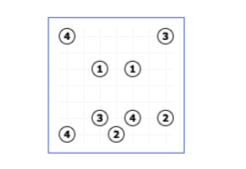
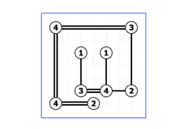

## Lógica para Programação - Projeto

# Solucionador de Puzzles Hashi (Parte I)

O objetivo deste projecto é escrever a primeira parte de um programa em PROLOG para
resolver puzzles hashi, de agora em diante designados apenas por “puzzles”.

Um puzzle hashi é constituído por uma grelha `n×m`(`n` linhas,`m` colunas). Cada posição
da grelha pode estar vazia, ou conter uma `ilha`, com a indicação do número de pontes
que essa ilha deverá ter, na solução do puzzle. Na Figura 1 mostra-se um exemplo de um
puzzle 7 × 7 , com 9 ilhas.


```
Figura 1: Puzzle de dimensão 7 × 7.
```
Na primeira linha deste puzzle existem 2 ilhas: uma na posição (1, 1), com a indicação de
4 pontes, e outra na posição (1, 7), com a indicação de 3 pontes.

Para obter uma solução, as ilhas devem ser ligadas por pontes, de forma a respeitar o
número de pontes indicado por cada ilha e as seguintes restrições:

- Não há mais do que duas pontes entre quaisquer duas ilhas.
- As pontes só podem ser verticais ou horizontais e não podem cruzar ilhas ou outras
    pontes.
- Na solução do puzzle, as pontes permitem a passagem entre quaisquer duas ilhas.

Assim, o puzzle da Figura 1 tem uma única solução, que é apresentada na Figura 2.


```
Figura 2: Solução do puzzle da Figura 1.
```

## 1 Representação de puzzles Conteúdo

Um puzzle é representado por uma lista de listas, correspondendo cada lista interior a
uma linha do puzzle. Uma posição contendo uma ilha é representada por um inteiro
positivo, correspondendo ao número de pontes dessa ilha. As posições vazias são repre-
sentadas por zero. Por exemplo, o puzzle da Figura 1 é representado por

```
[[4, 0, 0, 0, 0, 0, 3],
[0, 0, 0, 0, 0, 0, 0],
[0, 0, 1, 0, 1, 0, 0],
[0, 0, 0, 0, 0, 0, 0],
[0, 0, 0, 0, 0, 0, 0],
[0, 0, 3, 0, 4, 0, 2],
[4, 0, 0, 2, 0, 0, 0]]
```

## 2 Trabalho a desenvolver

Nesta secção são descritos os predicados que deve implementar no seu projecto. Estes
serão os predicados avaliados e, consequentemente, devem respeitar escrupulosamente
as especificações apresentadas. Para além dos predicados descritos, poderá implementar
todos os predicados que julgar necessários.

Os predicados fornecidos no ficheiro `codigo_comum.pl` poderão ser-lhe úteis durante
o desenvolvimento do projeto. No ficheiro `puzzles_publicos.pl` encontram-se defi-
nidos alguns puzzles, alguns dos quais são usados nos exemplos desta secção. Para usar
estes ficheiros, deve colocar o comando `:- [codigo_comum, puzzles_publicos]`.
no início do ficheiro que contém o seu projecto.
